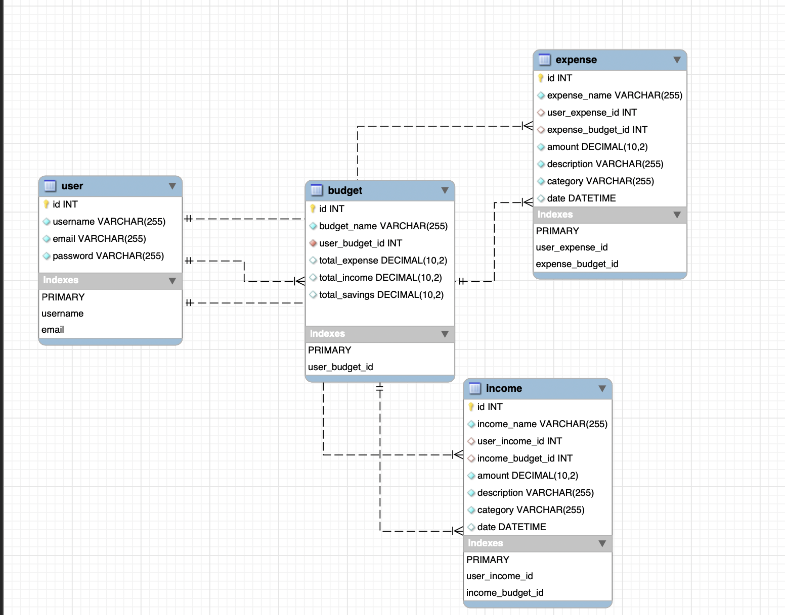

# WealthWise

Link to deployed page: [https://wealthwise-project2-1bf71934d0b7.herokuapp.com/](https://wealthwise-project2-1bf71934d0b7.herokuapp.com/)

WealthWise is an application that allows users to make monthly budget plans according to their spending habits. One of the features of WealthWise is its ability for users to add or delete expenses and view their through out the month to allow the user to adjust their balanaces accordingly. WealthWise is an application developed during bootcamp at the UCB Web Development bootcamp.

This application makes use of the following NPM packages:

| Badge Name                | Badge                                                                                                                                                       | Link                                                                                                            |
| ------------------------- | ----------------------------------------------------------------------------------------------------------------------------------------------------------- | --------------------------------------------------------------------------------------------------------------- |
| Faker                     | [](https://www.npmjs.com/package/@faker-js/faker)                                                         | [https://www.npmjs.com/package/@faker-js/faker](https://www.npmjs.com/package/@faker-js/faker)                     |
| Bcrypt                    | [](https://www.npmjs.com/package/bcrypt)                                                              | [https://www.npmjs.com/package/bcrypt](https://www.npmjs.com/package/bcrypt)                                       |
| Chart.js                  | [](https://www.npmjs.com/package/chart.js)                                                           | [https://www.npmjs.com/package/chart.js](https://www.npmjs.com/package/chart.js)                                   |
| Connect-Session-Sequelize | [](https://www.npmjs.com/package/connect-session-sequelize) | [https://www.npmjs.com/package/connect-session-sequelize](https://www.npmjs.com/package/connect-session-sequelize) |
| Dotenv                    | [](https://www.npmjs.com/package/dotenv)                                                          | [https://www.npmjs.com/package/dotenv](https://www.npmjs.com/package/dotenv)                                       |
| Express                   | [](https://www.npmjs.com/package/express)                                                      | [https://www.npmjs.com/package/express](https://www.npmjs.com/package/express)                                     |
| Express-Handlebars        | [](https://www.npmjs.com/package/express-handlebars)                   | [https://www.npmjs.com/package/express-handlebars](https://www.npmjs.com/package/express-handlebars)               |
| Express-Session           | [](https://www.npmjs.com/package/express-session)                                  | [https://www.npmjs.com/package/express-session](https://www.npmjs.com/package/express-session)                     |
| Handlebars                | [](https://www.npmjs.com/package/handlebars)                                             | [https://www.npmjs.com/package/handlebars](https://www.npmjs.com/package/handlebars)                               |
| MySQL2                    | [](https://www.npmjs.com/package/mysql2)                                                           | [https://www.npmjs.com/package/mysql2](https://www.npmjs.com/package/mysql2)                                       |
| Sequelize                 | [](https://www.npmjs.com/package/sequelize)                                                  | [https://www.npmjs.com/package/sequelize](https://www.npmjs.com/package/sequelize)                                 |
| Tabulator Tables          | [](https://www.npmjs.com/package/tabulator-tables)                              | [https://www.npmjs.com/package/tabulator-tables](https://www.npmjs.com/package/tabulator-tables)                   |
| HTML5                     |                                                                                                         | -                                                                                                               |
| ES6                       |                                                                                                             | -                                                                                                               |
| CSS                       |                                                                                                               | -                                                                                                               |


## Landing Page:


## Table of Contents
* [User Stories](#user-stories)
* [Code Highlights](#code-highlights)
* [Models and RESTful Routes](#models-and-restful-routes)
* [APIs and New Packages](#apis-and-new-packages)
* [Usage](#usage)
* [Installation](#installation)
* [Learning Points](#learning-points)
* [Author/Credits](#authorcredits)
* [License](#license)
 

## User stories
```md
AS A USER
I WANT to have my own account
SO THAT I can log into the system and manage my own assets
```
 

```js
router.use("/login", (req, res) => {
  if (req.session.logged_in) {
    res.redirect("/");
    return;
  }
  res.render("login");
});
```

```md
I WANT to be able to access expense and income categories
SO THAT I can factor that into my budgeting tool
```
 
```js
router.get("/items", useAuth, async (req, res) => {
  try {
    const userBudgetData = await Budget.findAll({
      where: {
        user_budget_id: req.session.user_id,
      },
    });

    const budgets = userBudgetData.map((budget) => budget.get({ plain: true }));
    console.log(budgets);
    res.render("items", {
      logged_in: req.session.logged_in,
      budgets
    });
  } catch (err) {
    console.log(err)
    res.status(500).json(err);
  }
});
```


```md
I WANT to be able to calculate a budget with specific parameters
SO THAT can create a budget accommodated to myself and my financial plan 
I WANT to create a budget to track my expenses and income 
SO THAT I can budget accordingly
I WANT to be able to see graphs and tables
```


```js
router.get("/budget/:id", useAuth, async (req, res) => {
  try {
    const userBudgetData = await Budget.findAll({
      where: {
        user_budget_id: req.session.user_id,
      },
    });

    const singleBudget = await Budget.findOne({
      where: {
        id: req.params.id,
      },
    });
    const budget = await singleBudget.get({ plain: true });
    const budgets = userBudgetData.map((budget) => budget.get({ plain: true }));
    if (budget.total_expense === null && budget.total_income === null) {
      return res.redirect(`/items/${req.params.id}`);
    }
    ƒ;
    req.session.budget_id = req.params.id;
    req.session.save();
    res.render("budgetAnalysis", {
      logged_in: req.session.logged_in,
      budgets,
      budget,
    });
  } catch (err) {
    res.status(500).json(err);
  }
});
```

```md
I WANT to be able to go back to edit certain income/expense
SO THAT I can change my budget based on my current circumstances
```
 
 ```js
router.get("/items/:id", useAuth, async (req, res) => {
  try {
    const userBudgetData = await Budget.findAll({
      where: {
        user_budget_id: req.session.user_id,
      },
    });
    const budgets = userBudgetData.map((budget) => budget.get({ plain: true }));
    req.session.budget_id = req.params.id;
    req.session.save();
    res.render("items", {
      logged_in: req.session.logged_in,
      budgets,
    });
  } catch (err) {
    res.status(500).json(err);
  }
});
 ```

```md
I WANT to be able to go back to delete and view
SO THAT I can review previous budgets and clear my budget list
```
 

```js
router.delete("/:id", async (req, res) => {
  try {
    const deleteBudget = await Budget.destroy({
      where: { id: req.params.id },
    });
    console.log(deleteBudget);
    if (!deleteBudget) {
      res.status(404).json({ message: "No budget found with this id!" });
      return;
    }
    res.status(200).json(deleteBudget);
  } catch (err) {
    console.log(err);
    res.status(500).json(err);
  }
});
```

## Code Highlights

Code snippet of data being seeded using fakerJs.

```javascript
const { faker } = require("@faker-js/faker");
const { User, Expense } = require("../models");

const createUsersExpenses = async () => {
  const users = await User.findAll();
    for (const user of users) {
      const expenses = [...Array(10)].map((expense) => ({
        expense_name: faker.commerce.productName(),
        user_expense_id: user.id,
        amount: faker.commerce.price(),
        description: faker.commerce.productDescription(),
        category: faker.commerce.department(),
        date: faker.date.past(),
      }));
      await Expense.bulkCreate(expenses);
    }
};
module.exports = createUsersExpenses;

```
## Models and RESTful Routes

### Models
The data model associations were integrated to create links from the expenses and income to the budget through the foreign key associations. The foreign key, user_budget_id, within the budget allowed us to access all of the expenses and income of a user through their given budget.



```js
Budget.hasMany(Income, {
    foreignKey: 'budget_id',
});

Income.belongsTo(Budget, {
    foreignKey: 'budget_id',
});

Budget.hasMany(Expense, {
    foreignKey: 'budget_id',
});

Expense.belongsTo(Budget, {
    foreignKey: 'budget_id',
});

...

User.hasMany(Budget, {
    foreignKey: 'user_budget_id',
});

Budget.belongsTo(User, {
    foreignKey: 'user_budget_id',
});
```
These associations allow us to query the database effectively from the backend and return data based on specific user budgets. 


### RESTful Routes
Budgets:
* GET /budgets - Retrieve all budgets.
* GET /budgets/:id - Retrieve a specific budget.
* POST /budgets - Create a new budget.
* PUT /budgets/:id - Update a specific budget.
* DELETE /budgets/:id - Delete a specific budget.

Income:
* GET /budgets/:budget_id/incomes - Retrieve all incomes for a specific budget.
* GET /budgets/:budget_id/incomes/:id - Retrieve a specific income for a specific budget.
* POST /budgets/:budget_id/incomes - Create a new income for a specific budget.
* PUT /budgets/:budget_id/incomes/:id - Update a specific income for a specific budget.
* DELETE /budgets/:budget_id/incomes/:id - Delete a specific income for a specific budget.

Expenses:
* GET /budgets/:budget_id/expenses - Retrieve all expenses for a specific budget.
* GET /budgets/:budget_id/expenses/:id - Retrieve a specific expense for a specific budget.
* POST /budgets/:budget_id/expenses - Create a new expense for a specific budget.
* PUT /budgets/:budget_id/expenses/:id - Update a specific expense for a specific budget.
* DELETE /budgets/:budget_id/expenses/:id - Delete a specific expense for a specific budget.

These routes follow REST principles and are based on the relationships between the models  defined in the application. They allow us to perform CRUD operations on the different resources, maintaining the data integrity and associations defined in our models.

Code snippet of a data model using life-cycle hooks to control data validation and formatting: 

```javascript
class Expense extends Model {}

Expense.init(
  {
    id: {
      type: DataTypes.INTEGER,
      allowNull: false,
      primaryKey: true,
      autoIncrement: true,
    },
    expense_name: {
      type: DataTypes.STRING,
      allowNull: false,
      validate: {
        len: [1, 255],
      },
    },
    user_expense_id: {
      type: DataTypes.INTEGER,
      references: {
        model: "user",
        key: "id",
      },
    },
    budget_id: {
      type: DataTypes.INTEGER,
      references: {
        model: "budget",
        key: "id", 
      },
    },
    amount: {
      type: DataTypes.DECIMAL(10, 2),
      allowNull: false,
      validate: {
        isNumeric: true,
      },
    },
    description: {
      type: DataTypes.STRING,
      allowNull: false,
      validate: {
        len: [0, 255],
      },
    },
    category: {
      type: DataTypes.STRING,
      allowNull: false,
      validate: {
        len: [1, 255],
      },
    },
    date: {
      type: DataTypes.DATE,
    },
  },
  {
    hooks: {
      async beforeCreate(newExpenseData) {
        if (newExpenseData.description === null) {
          newExpenseData.description = "No description provided.";
        }
        if (newExpenseData.description.length > 255) {
          newExpenseData.description = newExpenseData.description.substring(
            0,
            255
          );
        }
        if (newExpenseData.description.length < 1) {
          newExpenseData.description = "No description provided.";
        }
        if (newExpenseData.amount === null) {
          newExpenseData.amount = 0.0;
        }
        if (typeof newExpenseData.amount === "number") {
          newExpenseData.amount = parseFloat(newExpenseData.amount).toFixed(2);
        }
        return newExpenseData;
      },
    },
    sequelize,
    timestamps: false,
    freezeTableName: true,
    underscored: true,
    modelName: "expense",
  }
);
```

## APIs and New Packages

### Tabulator
```js
const renderOverviewTable = async (data) => {
  const dataObj = [
    ...data.dataOne.map(({ income_name, user_income_id, ...rest }) => ({
      ...rest,
      name: income_name,
      user_id: user_income_id,
      type: "Income",
    })),
    ...data.dataTwo.map(({ expense_name, user_expense_id, ...rest }) => ({
      ...rest,
      name: expense_name,
      user_id: user_expense_id,
      type: "Expense",
    })),
  ];
```

### Faker JS
```js
const createUsers = async () => {
    const users = [...Array(10)].map((user) => ({
      username: faker.internet.userName(),
      email: faker.internet.email(),
      password: bcrypt.hashSync("password", 10),
    }));
  
    await User.bulkCreate(users);
};
```

### Chart JS
```js
onst renderIncomeChart = async (data) => {
  const labels = Object.keys(data.totals);
  console.log(data)
  const values = Object.values(data.totals);
  const chartData = {
    labels: labels,
    datasets: [
      {
        data: values,
        backgroundColor: colors,
        hoverBackgroundColor: colors,
      },
    ],
  };
```

## Installation

For Development:

1. Clone or fork the repository from "https://github.com/ShirvanyanKaren/WealthWise"
2. Navigate to the root directory of the project using CLI.
3. Install node modules using "npm install"
4. Create a .env file to store your MySQL credentials
5. Create the database by running "mysql -u root -p" then enter your password.
6. Once you are connected to MySQL, from the CLI type: "source /db/schema.sql"

**MySQL and Node.js will need to be installed by the user.**

Link to MySQL Downloads: [https://www.mysql.com/downloads/](https://www.mysql.com/downloads/)

Link to Node.js Downloads: [https://nodejs.org/en](https://nodejs.org/en)

## Usage

1. Visit the deployed page at: [https://wealthwise-project2-1bf71934d0b7.herokuapp.com/](https://wealthwise-project2-1bf71934d0b7.herokuapp.com/)
2. Click the option to sign-up if it is your first time visiting the site, if you already have a user account hit login
3. Once logged click create budget
4. You will be prompted to provide a name for your budget - Note no two budges can have the same name.
5. The next screen will allow you to input your known monthly expenses and income. you will need to provide a name category and amount. Description is optional.
6. When you add a new item it will appear dynamically inside of the tables respective of their types. You can delete an item by hitting the x button on the table.
7. Once you are content you will need to hit the submit button to save your plan.
8. You will be taken to a window that will display charts and tables corresponding to your values you have selected you will also be given a monthly financial breakdown of your costs and income values as well as your net gain or loss.
9. You can edit your plan by clicking on the View Budgets to return to the area to add or remove items from that saved plan.


## Learning Points

Building MySQL Databases, Tables, Cookies and authentication handling. Alternatives to storing plain text passwords using databases. Front end / Back end integration using Restful routes. Creating and manipulating data using MySQL and Sequelize. Use of ORMs. And front-end / back-end integration.


## Author/Credits

Michael Mattingly

* [LinkedIn](https://www.linkedin.com/in/michael-mattingly-5580b1280/)

Xiaoran Cai

* [LinkedIn](https://www.linkedin.com/in/xrcai/)

Karen Shirvanyan

* [LinkedIn](https://www.linkedin.com/in/karen-shirvanyan-8a46a01a3/)

This project uses the following packages:

* Node.js - [https://nodejs.org/en](https://nodejs.org/en)
* MySQL - [https://www.mysql.com/](https://www.mysql.com/)
* MySQL2 - [https://www.npmjs.com/package/mysql2](https://www.npmjs.com/package/mysql2)
* Bcrypt - [https://www.npmjs.com/package/bcrypt](https://www.npmjs.com/package/bcrypt)
* Connect-session-sequelize - [https://www.npmjs.com/package/connect-session-sequelize](https://www.npmjs.com/package/connect-session-sequelize)
* Dotenv - [https://www.npmjs.com/package/dotenv](https://www.npmjs.com/package/dotenv)
* Express - [https://www.npmjs.com/package/express](https://www.npmjs.com/package/express)
* Faker.js - [https://www.npmjs.com/package/@faker-js/faker](https://www.npmjs.com/package/@faker-js/faker)
* Chart.js - [https://www.chartjs.org/](https://www.chartjs.org/)
* Express-handlebars - [https://www.npmjs.com/package/express-handlebars](https://www.npmjs.com/package/express-handlebars)
* Handlebars - [https://www.npmjs.com/package/handlebars](https://www.npmjs.com/package/handlebars)
* Express-session - [https://www.npmjs.com/package/express-session](https://www.npmjs.com/package/express-session)
* Sequelize - [https://www.npmjs.com/package/sequelize](https://www.npmjs.com/package/sequelize)

  Background photo was obtained through Unsplash, by artist: Daniel Seßler: [UnSplash Account](https://unsplash.com/@danielsessler?utm_source=unsplash&utm_medium=referral&utm_content=creditCopyText).

  Logo was obtained via [Canva](http://www.canva.com).

## License

This project is licensed under the [MIT License](https://github.com/MeanBean87/readme-generator/blob/main/LICENSE). Please refer to the LICENSE file for more details.
